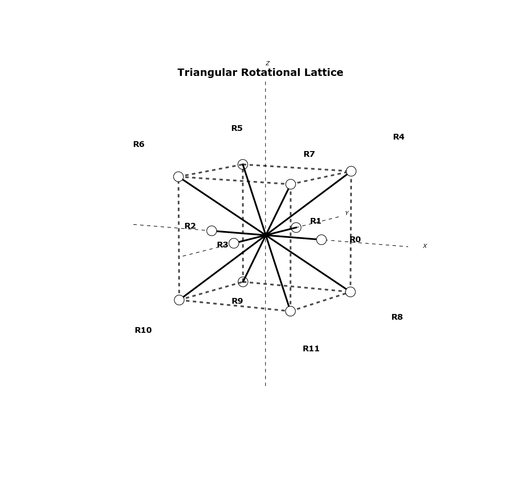

%Marathon v0.9.4 Manual 
%
%April 6, 2013

# Introduction #

Marathon is a Python script designed to iteratively rotate molecules read from Protein Data Bank files. 
All rotations along a given lattice are performed for each branch in a molecule and the results are 
printed to output files.  Plotting of the iterations is also provided.  Currently rotations along a 
cubic and face centered cubic  (triangular) lattices are supported. 
The program ensures that no immediate bond overlap will occur.  It can optionally print the 
overlapping bonds to a file.  The script is also able to iteratively calculate the Root Mean Square
 Distance  (RMSD) of the molecule and print this to a file.

# Usage #

The script is intended to be run from the command line, using the Python interpreter version 2.7+.  

## Requirements ##

Marathon requires [Python v2.7](http://www.python.org), as well as the python packages 
[numpy](http://www.numpy.org/) and (Optional for plotting) [matplotlib](http://www.matplotlib.org).
To install the requirements it is advised to use the python `easy_install` or the more recent `pip`, ie:

	pip install numpy
	pip install matplotlib

There is optionally a `requirements.txt` file provided.  When installing on a new system or a 
virtual environment, this file can be used with `pip` to install all necessary packages

	pip install -r requirements.txt

### Mac OSX ###

A good article detailing how to best install numpy and matplotlib on Mac OS-X is [here](http://www.lowindata.com/2013/installing-scientific-python-on-mac-os-x/).  If interactive plotting is needed, use the QtAgg backend in your matplotlibrc file.

## Program Execution ##

This guide assumes that python and the script requirements are installed and available on the system path.  
Furthermore, it assumes that the `marathon.py` script is also available in the path or the current 
working directory.  The program is executed with arguments and options, as given

	usage: marathon.py [-h] [-v] [-o OUTPUT] [-c] [-t] [-p] [-i] [-r] [-d]
    	               [--print-skips]
    	               args [args ...]

	Program to parse a PDB file, identify isolation loops, and permute molecular
	rotations around those loops and write back to a set of PDB files

	positional arguments:
	  args                  One or more filenames or directories

	optional arguments:
	  -h, --help            show this help message and exit
	  -v, --verbose         Print details to console
	  -o OUTPUT, --output OUTPUT
	                        Output new PDB files to this directory
	  -c, --cubic           Rotate around a cubic structure (default), i.e. 90 deg
	  -t, --triangular      Roatate around a triangular structure, i.e. 45 deg
	  -p, --plot            Plot the rotated molecules in a `plots` subfolder
	  -i, --interactive     Plot figures interactively
	  -r, --rmsd            Calculate the root means square distance of each
	                        iteration and save all values to a file
	  -d, --detailed        Save the iteration names with detailed information for
	                        each branch and rotation number, otherwise just use
	                        the iteration counter as a name
	  --print-skips         Print the skipped rotation iteration names to a file
	                        in the output directory

For example, to iterate cubic rotations on a single file `mymol.pdb` and output to a local directory `output_dir`,
one can simply execute::

	python marathon.py -o output_dir mymol.pdb

This will save .pdb files in the `output_dir/mymol/rotations` directory corresponding to each
rotation iteration.  

By default, the iterations are simply numbered incrementally from 1.  If more detailed iteration names are required,
the `-d` or `--detailed` flags are available which will save the filenames in a more detailed manner stating the 
exact rotation matrix on each branch that was applied for that iteration, this takes a form [B?R?], where '?' are
the branch number and roation number, accordingly.

The script can optionally calculate the root mean square distance for each iteration.  This is done by calling 
the `-r` or `--rmsd` flags during program execution.  This will create a file `rmsd.txt` in the output
directory and append the iteration name and rmsd for that iteration.  The script `min_rmsd.py` can read this
file to output the iterations with the minimum values.

The `--print-skips` flag saves the names of any rotations which would lead to a bond overlap at a 
flexible joint to a file `interfering.iterations.txt` in the output directory.

## Plotting ##

Marathon also has simple plotting functionality, capable of plotting a molecule
in 3D space.  This is accomplished using the python matplotlib package. The plots are
signaled using the `-p` or `--plot` flag upon program execution

	python marathon.py -o output_dir -p mymol.pdb

Optionally, the `-i` or `--interactive` flags can be given and the program 
will display each plot using matplotlib's interactive plot viewer.  This is useful
for getting immediate feedback as to what rotations are being performed.  The 
interactive flag renders the plot flag unneccesary.

### Configuration ###

If the interactive plotting is being used, there may be some required local configuration of
the matplotlib backend that is used to render the plots to a screen.  This is achieved by including a `matplotlibrc` file in the working directory locally or in a Users home folder for a more global 
implementation.  More on `matplotlibrc` files can be found [here](http://matplotlib.org/users/customizing.html?highlight=matplotlibrc) and more on graphics backends can be found [here](http://matplotlib.org/faq/usage_faq.html#what-is-a-backend).

# Methodology #

This section describes the algorithm that marathon uses to rotate a given molecule.  It describes the 
file format used, definitions of flexible points and subsequent branches,
rotation lattices presently supported, branch rotations, and rotation branch overlap detection.

## PDB File format ##

The molecules are read and written using the [.pdb] file format as specified by the 
[World Wide Protein Data Bank](http://www.wwpdb.org/docs.html).  

Marathon currently uses a module from the [pymmlib](http://pymmlib.sourceforge.net/) 
package to read and write the molecules using this format. 
Relevant information parsed from these files for the purpose of the script are the atom ids, positions and element label, and the bond connections between the atoms

## Branches and Flexible Points ##

This script defines a **flexible point** as any nitrogen (N) atom in the molecule sharing bonds with 
*only* carbon (C) atoms and at least 2 of them.  This applies to any atom along a chain that does not occupy
and end point. A flexible point may have 2 or more bonds attached to it, the set of flexible point and 
bonding atom represents a unique **branch** in the molecule.  The unique branches and the subsequent chain
of atoms along that branch are what are rotated for each rotation iteration. The vector that is made
by the flexible point and the bond atom is called a **branch vector**.  This branch vector serves as the 
reference vector for all rotations.  

## Branch Rotation ## 

### Unit Rotations ###

Each branch is allowed to be rotated to direct itself along a specified vector.  The exact vector
is depedent on the the lattice that is being used, i.e. cubic or triangular, as well as the 
unique iteration being applied.  When a rotation occurs, all of the decendent atoms are also
rotated accordingly. These so called *unit rotations* are applied iteratively throughout the
molecule until a given set of unit rotations have been applied.  
 
The exact rotations which are used for each branch for each iteration are dependent on the 
rotation latticethat is being applied. 

### Cubic Lattice ###

A cubic lattice is the set of 90 degree rotations that a branch can undergo in 3D space. For the unit 
branch shown in Figure 1, there are 6 unique rotations that can be performed relative to the branch vector.

### Triangular Lattice ###

This lattice is similar to the body centered cubic structure as seen in Figure 2. There are 4 rotations along the xy plane, and 8 rotations towards the vertices of an imaginary cube, giving
12 unique rotations.

## Overlap Detection ##

Before the entire branch is rotated during an iteration, the new bond direction is compared
against all other bond vectors at that flexible point which has already been rotated.  
If any of these rotated bond vectors are in line with the new bond direction. an overlap
is signalled and the entire rotation iteration is skipped, and the rotation iteration name is
optionally printed to a file.

## Permutations over the Lattice ##

A given lattice has $R$ number of unique vectors for a branch to point.  In the cubic lattice
case, there are 6.  Each branch can be rotated to face along any one of these vectors.  Over the
entire molecule made up of $B$ branches, this results in a maximum number of expected permutations 
  
$$\frac{R!}{(R - B)!}$$

